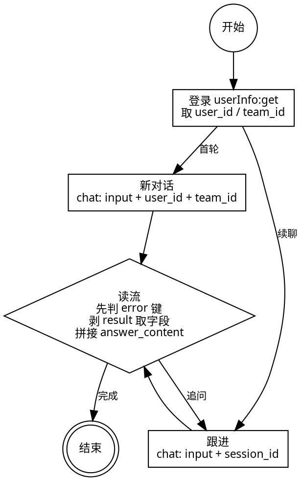

# DamClaw Skill API

创意管家"AI 策略分析"对外 Skill 接口，供 openclaw 流式调用。Skill 发起的对话会同步到创意管家网页端"AI 策略分析"对话列表。

## 概述

| 项 | 说明 |
|---|---|
| 形态 | HTTP chunked NDJSON 流（server-side streaming），每行一个 JSON，连接关闭 = 流结束 |
| 能力 | 策略探索（直接出完整报告）/ 灵感激发（多轮渐进追问，每轮流式返回增量 markdown） |
| 多轮 | 首轮建对话返回 session_id，跟进带 session_id 续聊 |
| 鉴权 | `Authorization: YC_API_KEY {API Key}`（前缀是 `YC_API_KEY`，不是 `Bearer`） |

## 域名

| 环境 | 域名 |
|---|---|
| 生产 | `https://console.dam.youcloud.com` |

下方接口 URL 以相对路径给出，拼到对应域名后调用。

## 调用步骤（skill 必须按序执行）

1. **登录取身份**：用 yc_key 调 `GET /api/rpc/user/v1/user/userInfo:get`，拿到 `user_id` 和 `team_id` 并记住。
2. **发起对话**：调 `POST /api/rpc/ai/claw/v1/chat`（流式），把 `user_id`、`team_id` 填进 request body。若忘了这俩值，回到第 1 步重新取。
3. **判断首轮/跟进**：首轮不传 `session_id`（可选 `chat_mode`：2=策略探索 / 3=灵感激发）；跟进传上一轮首包返回的 `session_id`（不传 `chat_mode`）。是否首轮由 skill 按对话上下文判断。
4. **逐行读流**，每行一个 JSON：
   - 先判有没有 `error` 键 → 有则停止拼接、报告错误（见"错误处理"）；
   - 否则剥掉外层 `result`，取 `answer_content` / `session_id`；
   - 首包带 `session_id`，记住；`answer_content` 为空的行（首包/心跳）跳过；
   - 把非空 `answer_content` 拼接成完整 markdown。
5. **收尾**：连接关闭且无 `error` 行 = 流正常结束，用拼接好的完整 markdown 原样回复用户；保存 `session_id` 供后续追问。

## 身份约束（必读）

- 每次发起对话都**必须显式传** `user_id` / `team_id`，后端从 request body 取值并校验其与 yc_key 鉴权身份一致（不接受从 header/ctx 偷拿）。
- **类型注意**：userInfo:get 返回的 `user_id` 是**字符串**（如 `"858499"`），chat 请求的 `user_id` 是 **int64**。调 chat 前请转成数字：
  - Python：`int(user_id)`
  - PowerShell：`[int]$userId`
  - curl：拼接时不加引号
  - 实测后端对字符串也能容忍解析，但 proto 定义是 int64，建议显式转 number。

## 接口

### 1. 登录获取身份

| 项 | 值 |
|---|---|
| HTTP | `GET /api/rpc/user/v1/user/userInfo:get` |
| RPC | `dam.user.v1.User/GetCurrentUser` |
| 鉴权 | `Authorization: YC_API_KEY {API Key}` |
| 请求参数 | 无（身份由 yc_key 决定） |

响应（snake_case，已联调实测）：

```json
{ "user_id": "858499", "team_id": "56ca5cf9-...", "user_name": "用户名", "team_name": "企业名" }
```

| 字段 | 类型 | 说明 |
|---|---|---|
| `user_id` | string | 用户 ID（发起对话必传，需转 number 传给 chat） |
| `team_id` | string | 企业 ID（发起对话必传，原样传给 chat） |
| `user_name` / `team_name` | string | 用户/企业名（可选，展示用） |

> 完整响应另含 `avatar` / `role` / `quotas` 等，skill 一般只需 `user_id` / `team_id`。

### 2. 发起对话

| 项 | 值 |
|---|---|
| HTTP | `POST /api/rpc/ai/claw/v1/chat` |
| RPC | `dam.ai.claw.v1.DamClaw/Chat`（server-side streaming） |
| 鉴权 | `Authorization: YC_API_KEY {API Key}` |
| Content-Type | `application/json; charset=utf-8` |
| 客户端超时 | ≥ 650s（服务端最长约 600s，留安全边界） |

请求体：

```json
{
  "input": "用户问题，可带 @灵感库 / @物料 / @成片 / @账户素材 / @有数 / @AppGrowing",
  "user_id": 123,
  "team_id": "由 userInfo:get 返回",
  "session_id": "chat_gid（跟进时传，新对话不传）",
  "chat_mode": 2
}
```

| 字段 | 必填 | 类型 | 说明 |
|---|:---:|---|---|
| `input` | 是 | string | 用户问题。`@素材来源` 是软提示（agent 据此限定检索范围），后端不解析。 |
| `user_id` | 是 | int64 | 用户 ID，由"登录获取身份"返回，显式传入。 |
| `team_id` | 是 | string | 企业 ID，由"登录获取身份"返回，显式传入。 |
| `session_id` | 否 | string | 对话 ID（= chat_gid），服务端生成的 opaque 值，skill 应原样传递、不做解析。首轮不传；跟进必传（复用同一对话、带历史）。 |
| `chat_mode` | 否 | int32 | 模式，仅新对话传：`2`=策略探索（默认）/ `3`=灵感激发。跟进**静默忽略**（即使传入也不影响响应、不报错）。 |

> `chat_mode` 用创意管家内部枚举（2/3），与有数 youclaw（2/5）不同。仅 2/3 合法，其余后端返回 400。

## 流式响应格式

每行一个 JSON（NDJSON）。`answer_content` 拼接起来就是完整 markdown。共四种行：

| 行类型 | 形态 | 说明 |
|---|---|---|
| 首包 | `{"result":{"answer_content":"","session_id":"chat_gid"}}` | 进流即发：让 HTTP 流立即开始 + 投递 session_id（哪怕 worker 零输出也必达，供 skill 记住用于跟进） |
| 数据包 | `{"result":{"answer_content":"增量片段"}}` | 拼接到 output |
| 心跳包 | `{"result":{"answer_content":"","session_id":""}}` | worker 长时间无产出时保活（约每 5s 一发），skill 跳过 |
| 错误尾包 | `{"error":{"code":X,"message":"..."}}` | **不包 `result`**；只在流中段 worker 出错时出现，详见下文 |

关于 `result` envelope 与字段可见性：

- grpc-gateway 对 server-side streaming 的每条**数据**消息默认包一层 `result` 字段（源码：`runtime/handler.go` 流式 marshal）。真正的 `answer_content` / `session_id` 在 `result` 里，解析时**先剥 `result`**。
- **错误尾包例外**：流中段错误走 grpc-gateway 的 `errorChunk`（`{"error": status.Proto()}`），**不包 `result`**。解析每行时**先判有没有 `error` 键**。
- 空字符串字段会**原样输出**（不省略），如心跳包仍带 `"answer_content":""`、`"session_id":""`。skill 用 `.get("answer_content")` 取值，空串自然 falsy。

NDJSON 示例：

```jsonl
{"result":{"answer_content":"","session_id":"chat_gid"}}
{"result":{"answer_content":"# 探索"}}
{"result":{"answer_content":"结果"}}
{"result":{"answer_content":"","session_id":""}}
{"result":{"answer_content":"完结。"}}
{"error":{"code":13,"message":"worker internal error"}}
```

### 结束与错误（两种场景，HTTP 状态码不同）

- **流前错误**（鉴权失败 / 参数非法 / session 不存在或跨租户）：HTTP **非 2xx**（401/400/404），body 是单行 `{"error":{...}}`，**无任何数据 chunk**。skill 读 status + `error` 报错；无 session_id，需新建对话重试。
- **流中段错误**（worker 内部出错，done 带 error）：HTTP **200**（首包写出时 header 已 commit，无法再变非 2xx），已发数据 chunk（含首包 session_id）正常到达，流末尾追加一行 `{"error":{...}}`（不包 `result`）。skill 检测到 `error` 键则停止拼接、报告错误；首包 session_id 在 error 前已发掉，可据其跟进/重试。
- **正常结束**：连接关闭且无 `error` 行 = worker 写完 done 无 error。

## session_id 多轮语义

- **新对话**：不传 `session_id` + 传 `chat_mode` → 建新对话 → 流首包带 session_id。
- **跟进**：传 `session_id` + 不传 `chat_mode` → 复用对话（带历史），agent 续聊，流首包回带同一 session_id。
- **不传 session_id** = 每次全新对话、无记忆。
- **属主隔离**：session_id 必须属于当前 API Key 的企业；跨租户或不存在，后端返回 404 NotFound（不泄露 session 是否存在）。只复用本接口返回的 session_id。
- 首轮还是续聊由 skill 自行判断（如用户是否在同一对话上下文、是否带了已有 session_id），后端只按"是否传 session_id"区分。

## @素材来源（软提示，可选）

在 `input` 里 `@` 某素材来源，agent 优先在该范围检索：

| @ | 含义 |
|---|---|
| `@灵感库` | 用户采集的外部三方素材 |
| `@物料` | 自行拍摄制作的物料 |
| `@成片` | 自行拍摄制作且后期处理好的成片 |
| `@账户素材` | 授权账户同步的一方素材（千川标准/全域直播/全域商品、Facebook） |
| `@有数` | 有数上的三方素材 |
| `@AppGrowing` | AppGrowing 中国版三方素材 |

不 `@` = 默认全范围。`@` 是给 agent 的自然语言提示，后端不解析。

## 红线

- 客户端超时 ≥ 650 秒（服务端最长约 600s）。
- 后端不主动断流，超时后已发送内容不丢。
- 逐行读流拼接 `answer_content`，空行（首包/心跳）跳过；连接关闭且无 `error` 行 = 流正常结束。
- **不要**在流未结束前把半截 markdown 当完整结果回复用户；等连接关闭后用拼接好的完整 markdown 回复。

## 错误处理

skill **按 HTTP status 处理即可**；body 里的 `error.code`（gRPC 状态码）仅供深度排查。

| 情况 | HTTP status | body | 处理 |
|---|---|---|---|
| 鉴权失败 | 401 | `{"error":{...}}` | API Key 认证失败，检查密钥是否激活/过期，在个人中心-企业信息重新获取。 |
| chat_mode 非法 | 400 | `{"error":{...}}` | chat_mode 仅支持 2（策略探索）/ 3（灵感激发）。 |
| session 不存在或跨租户 | 404 | `{"error":{...}}` | session_id 无效或不属于当前企业；无 session_id 可用，需新建对话重试。 |
| 流中段错误（worker 出错） | **200** | 末尾追加 `{"error":{...}}`（不包 result） | 已发数据 chunk（含首包 session_id）正常到达；检测到 `error` 键停止拼接、报告错误；首包 session_id 可据其跟进/重试。 |
| 5xx / 网关错误 | 500/502/503/504 | 可能非 JSON | 网关/上游问题（如 rancher 重启、反代超时），按网络问题重试，不要 `json.loads` 整个 body。 |
| 超时（>650s） | — | — | 还在分析中，稍后再问结果或重新请求。 |
| 其他 | 非 2xx | `{"error":{"code":X,"message":"..."}}` | 按 `error.code`（gRPC 状态码）排查 API Key 权限、账号配额或联系客服。 |

## 调用示例

### curl（流式，逐行消费 NDJSON）

```bash
# 环境变量：YOUCLOUD_API_KEY / DAM_USER_ID / DAM_TEAM_ID（后两者由 userInfo:get 返回）
curl -N -X POST https://console.dam.youcloud.com/api/rpc/ai/claw/v1/chat \
  -H "Authorization: YC_API_KEY $YOUCLOUD_API_KEY" \
  -H "Content-Type: application/json; charset=utf-8" \
  --max-time 650 \
  -d "{\"input\":\"分析这个美妆品牌的投放策略，重点 @灵感库\",\"user_id\":$DAM_USER_ID,\"team_id\":\"$DAM_TEAM_ID\",\"chat_mode\":2}"
# body 外层用双引号、内部转义，$DAM_USER_ID / $DAM_TEAM_ID 才会被 shell 展开（user_id 是数字不加引号）。
# 输出多行 JSON：数据行 {"result":{...}}，流中段错误行 {"error":{...}}（不包 result）。
# 先判 error 键，否则剥 result 取字段。
```

### Python（requests 流式消费）

```python
import json, requests

resp = requests.post(
    "https://console.dam.youcloud.com/api/rpc/ai/claw/v1/chat",
    headers={"Authorization": f"YC_API_KEY {api_key}"},
    json={"input": question, "user_id": int(uid), "team_id": tid, "chat_mode": 2},  # uid 转 int
    stream=True, timeout=650,
)

# 流前错误（401/400/404）：HTTP 非 2xx，body 是单行 {"error":{...}}，无数据 chunk。
if resp.status_code != 200:
    err = json.loads(resp.text).get("error", {})
    raise RuntimeError(f"DamClaw.Chat 流前错误 status={resp.status_code} code={err.get('code')} msg={err.get('message')}")

output = ""
session_id = ""
for line in resp.iter_lines(decode_unicode=True):
    if not line:
        continue
    envelope = json.loads(line)
    if "error" in envelope:  # 流中段错误尾包（不包 result）
        err = envelope["error"]
        raise RuntimeError(f"DamClaw.Chat 流中段错误 code={err.get('code')} msg={err.get('message')} (session_id={session_id})")
    chunk = envelope["result"]  # 剥掉 result envelope
    if chunk.get("session_id"):      # 首包带 session_id，记住
        session_id = chunk["session_id"]
    if not chunk.get("answer_content"):  # 空 = 心跳/首包，跳过
        continue
    output += chunk["answer_content"]
# 连接关闭且无 error 行 = 流正常结束
```

### PowerShell（仅联调调试；生产流式需 .NET HttpClient）

```powershell
[Console]::OutputEncoding = [System.Text.Encoding]::UTF8
$apiKey  = $env:YOUCLOUD_API_KEY
$userId  = [int]$env:DAM_USER_ID   # userInfo:get 返回 string，这里显式转 int
$body = @{input="分析这个美妆品牌的投放策略，重点 @灵感库"; user_id=$userId; team_id=$env:DAM_TEAM_ID; chat_mode=2} | ConvertTo-Json -Compress

# Invoke-WebRequest 会等响应完成整体返回，无法逐行增量消费 NDJSON，
# 仅适合联调一次性拿完整 body 检查。生产 skill 必须改用 .NET HttpClient +
# ReadAsStreamAsync（参考微软文档）。
$resp = Invoke-WebRequest -Uri "https://console.dam.youcloud.com/api/rpc/ai/claw/v1/chat" `
  -Method Post -ContentType "application/json; charset=utf-8" `
  -Headers @{Authorization="YC_API_KEY $apiKey"} -Body $body -TimeoutSec 650
# $resp.Content 是完整 body，每行 {"result":{...}} 或末尾 {"error":{...}}，自行按行 split 解析
```

## Skill 执行流程（状态机，联调参考）

skill 可参考下面的 Graphviz DOT 设计执行状态机（联调时做成状态约束效果更好）：


